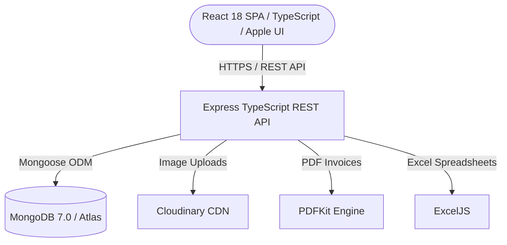

# Cab Castle Goa — Premium Cab Rental & Tour Travels Platform

[](https://cabcastlegoa.com)
[](LICENSE)

An enterprise-grade, full-stack cab rental and sightseeing tour travel booking platform, reservation engine, and business CRM engineered specifically for **Cab Castle Goa** (Owner: **Dasgir Adur**, Contact: **+91 70266 48960**, Email: **dasgiradur@gmail.com**).

---

## 🌴 Overview

**Cab Castle Goa** provides premium cab services with verified local drivers, 8 hrs / 80 km full-day tour packages, North & South Goa sightseeing, and 24/7 direct airport pickup/drop transfers (GOI Dabolim & GOX Mopa).

It features a high-conversion customer booking flow, dynamic 8h/80km & airport transfer quote calculator, mock Razorpay payment processing with instant UPI QR verification, instant PDF/HTML invoice generation, an executive CRM dashboard, automated refund management, offline walk-in bookings, fleet timeline management, and modern Prussian Dark & Ocean Cyan design aesthetics.

---

## Key Features

### Customer Experience Portal
- **Fleet Catalog**: Choose from Sedans, SUVs, and Hatchbacks for 8h/80km sightseeing or airport transfers.
- **Dark Prussian & Ocean Cyan Theme**: High-contrast, clean typography (Nunito & Outfit), vibrant cyan accents, responsive mobile navigation.
- **Dynamic Fare Breakdown & Coupons**: Real-time tour quotes accounting for 8h/80km packages, extra km/hr rates, airport transfers, and promo coupons.
- **Location Hubs**: Central operations hub at Assagao, Bardez, North Goa with 24/7 airport coverage (*Dabolim GOI*, *Mopa GOX*) and railway stations (*Thivim*, *Margao*).
- **Payment & Invoicing**: Integrated Razorpay workflow & instant UPI QR submission with automated invoice downloads.
- **Customer Account**: Track and manage active bookings and trip itineraries.

### Executive Admin Dashboard & Business CRM
- **Business Analytics**: Track monthly revenue, fleet utilization, and booking trends.
- **Fleet Timeline & Dispatch**: Visual dispatch management for tour bookings and airport pickups.
- **Fleet Manager**: Add and manage vehicles with full tour rates and airport package pricing.
- **Lead Generation CRM**: Inbound customer lead pipeline tracking inquiry channels (*WhatsApp*, *Website*, *Phone Call*).
- **Excel & PDF Exports**: Single-click workbook downloads for bookings and leads.

---

## Architecture & Technology Stack



- **Frontend**: React 18, TypeScript, Tailwind CSS v3, Radix UI Primitives, Lucide Icons, Axios, Sonner Toasts, `react-helmet-async`.
- **Backend**: Node.js 20, Express, TypeScript, Mongoose ODM, JWT, BcryptJS, PDFKit, ExcelJS, Multer, Cloudinary SDK.
- **Database**: MongoDB 7.0+ / MongoDB Atlas.
- **Storage & CDN**: Cloudinary CDN for vehicle photos (`drivehub_goa/vehicles/`) and KYC documents (`drivehub_goa/kyc_documents/`).
- **DevOps**: Multi-stage Node.js Alpine Dockerfiles, Nginx Alpine, Docker Compose.

---

## Documentation Index

Comprehensive documentation is organized in the [`docs/`](./docs) folder:

| Document | Description |
|---|---|
| [`docs/API_DOCUMENTATION.md`](./docs/API_DOCUMENTATION.md) | Complete REST API endpoint reference and payload specifications |
| [`docs/DATABASE_SCHEMA.md`](./docs/DATABASE_SCHEMA.md) | MongoDB collections, data types, indexes, and sample BSON records |
| [`docs/FULL_STACK_INTEGRATION_AUDIT_REPORT.md`](./docs/FULL_STACK_INTEGRATION_AUDIT_REPORT.md) | Phase A & B full-stack audit findings, bug fixes, and verification record |
| [`docs/DEPLOYMENT_GUIDE.md`](./docs/DEPLOYMENT_GUIDE.md) | Step-by-step production deployment instructions (Docker, VPS, Cloud) |
| [`docs/DEPLOYMENT_CAPACITY_ANALYSIS.md`](./docs/DEPLOYMENT_CAPACITY_ANALYSIS.md) | Infrastructure sizing, concurrency limits, and scaling recommendations |
| [`docs/SEO-KEYWORD-STRATEGY.md`](./docs/SEO-KEYWORD-STRATEGY.md) | Target keyword clusters, competitor gap analysis, and ranking strategy |
| [`docs/SEO-RANKING-DIAGNOSIS-TOP5.md`](./docs/SEO-RANKING-DIAGNOSIS-TOP5.md) | Search ranking diagnosis and competitor gap breakdown |
| [`docs/SEO-SETUP-GUIDE.md`](./docs/SEO-SETUP-GUIDE.md) | Search engine verification, Google Search Console, and structured data guide |
| [`docs/STRUCTURE.md`](./docs/STRUCTURE.md) | Full directory hierarchy and architectural layout |
| [`docs/PRD.md`](./docs/PRD.md) | Product requirements and feature specifications |

---

## Quick Start & Local Setup

### Prerequisites
- Node.js 18+ & npm
- MongoDB instance (Local MongoDB or MongoDB Atlas connection string)

### 1. Clone the Repository
```bash
git clone https://github.com/Jeeerryyy/DriveHub-Goa.git
cd DriveHub-Goa
```

### 2. Configure Environment Variables
Copy `.env.example` templates in both backend and frontend directories:

```bash
# Backend configuration
cp backend/.env.example backend/.env

# Frontend configuration
cp frontend/.env.example frontend/.env
```

### 3. Run Locally (Windows)
Run the automated launcher script:
```cmd
start_servers.bat
```

Or start the services manually:

```bash
# Terminal 1: Backend API (Port 8000)
cd backend
npm install
npm run dev

# Terminal 2: Frontend Web App (Port 3000)
cd frontend
npm install
npm start
```

- **Backend API Endpoint:** `http://localhost:8000/api`
- **Backend Health Check:** `http://localhost:8000/api/healthz`
- **Frontend Web App:** `http://localhost:3000`

### Default Test Credentials
- **Admin Portal:** `http://localhost:3000/admin/login`
  - Email: `dasgiradur@gmail.com`
  - Password: `Admin@123`
- **Demo Customer:** `http://localhost:3000/login`
  - Email: `demo@cabcastlegoa.com`
  - Password: `Demo@1234`

---

## Docker Deployment

To launch all services with Docker Compose:
```bash
docker-compose up --build -d
```

---

## Production Build & Test Validation

```bash
# 1. Run backend automated test suite (26 unit/integration tests)
cd backend && npm test

# 2. Compile backend TypeScript
cd backend && npm run build

# 3. Build optimized frontend production bundle
cd frontend && npm run build
```
