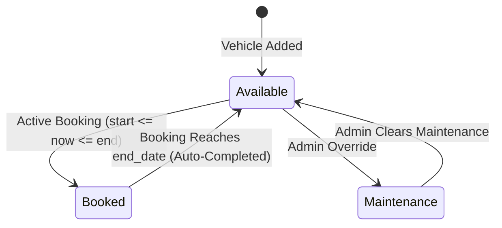
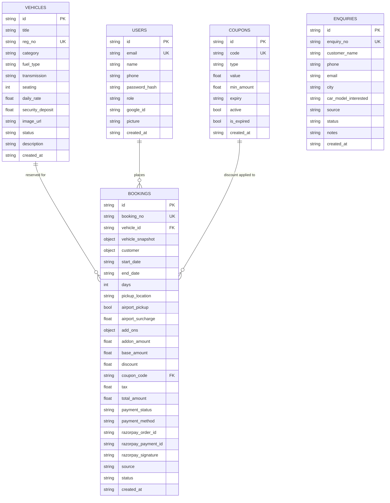

# DriveHub Goa — Database Schema & Data Architecture Documentation

This document provides a comprehensive specification of the **Drivehub Goa** MongoDB database architecture (`drivehub_goa`), collection schemas, data types, field definitions, indexing strategies, relationship models, state transitions, and JSON document representations.

---

## 1. Architectural Overview & Database Engine

- **Database Engine**: MongoDB 7.0+ (NoSQL document store)
- **Python Async Driver**: Motor (`AsyncIOMotorClient`) with PyMongo core bindings
- **Primary Database Name**: `drivehub_goa`
- **Data Format**: BSON / JSON documents with standard ISO-8601 strings for timestamps
- **Primary Key Strategy**: Application-generated UUIDv4 strings stored as `"id"` (MongoDB internal `"_id"` is excluded from API payloads for security and client portability)

---

## 2. Collections Overview

The database contains **5 primary collections**:

| Collection | Description | Document Count Baseline |
| :--- | :--- | :--- |
| **`users`** | User authentication accounts (Admins & Customers), passwords, and OAuth profiles | Seeded + Dynamic |
| **`vehicles`** | Fleet catalog, technical specifications, rates, status, and Cloudinary image URLs | 21 Seeded + Dynamic |
| **`bookings`** | Online & offline car rental reservations, customer details, fare breakdowns, and payment signatures | Seeded + Dynamic |
| **`coupons`** | Promotional discount codes, minimum spend thresholds, and expiration deadlines | Seeded + Dynamic |
| **`enquiries`** | Lead tracking CRM for customer calls, WhatsApp inquiries, walk-ins, and conversion statuses | Seeded + Dynamic |

---

## 3. Database Indexes Specification

Indexes are verified and initialized automatically during backend startup to ensure optimal query execution speeds ($O(\log N)$) and enforce uniqueness constraints.

```javascript
// Database Index Registrations
db.users.createIndex({ "email": 1 }, { unique: true });
db.vehicles.createIndex({ "id": 1 }, { unique: true });
db.vehicles.createIndex({ "reg_no": 1 }, { unique: true });
db.coupons.createIndex({ "code": 1 }, { unique: true });
db.bookings.createIndex({ "vehicle_id": 1, "start_date": 1, "end_date": 1 });
db.bookings.createIndex({ "status": 1 });
db.bookings.createIndex({ "customer.email": 1 });
```

---

## 4. Collection Schemas & Data Models

### 4.1. `users` Collection

Stores customer accounts and system administrator credentials.

#### Field Definitions
| Field | Type | Validation / Constraint | Description |
| :--- | :--- | :--- | :--- |
| `id` | String (UUIDv4) | Unique, Required | Primary application identifier |
| `email` | String | Unique, Lowercase, Trimmed, Email Format | Account login email address |
| `name` | String | Required | Full display name of user |
| `phone` | String | Optional / 10 digits | Mobile contact number |
| `password_hash` | String | Bcrypt hash | Password hash (omitted from API JSON responses) |
| `role` | String Enum | `"admin"` \| `"customer"` | Access control role |
| `google_id` | String | Optional | Google OAuth account identifier |
| `picture` | String (URL) | Optional | User profile avatar URL |
| `created_at` | String (ISO-8601) | UTC Timestamp | Account registration date |

#### Sample Document JSON
```json
{
  "id": "4fabe537-323e-4a29-902c-1268e6fc12ab",
  "email": "admin@drivehubgoa.com",
  "name": "Drivehub Admin",
  "phone": "+91 98000 00000",
  "password_hash": "$2b$12$EixZaYVK1fsbw1ZfbX3OXePaWxn96p36WQOEg6Lruj3vjPGga31lW",
  "role": "admin",
  "google_id": "",
  "picture": "",
  "created_at": "2026-08-07T12:00:00.000000+00:00"
}
```

---

### 4.2. `vehicles` Collection

Stores vehicle specifications, rental rates, security deposits, and real-time operational availability status.

#### Field Definitions
| Field | Type | Validation / Constraint | Description |
| :--- | :--- | :--- | :--- |
| `id` | String (UUIDv4) | Unique, Required | Primary vehicle identifier |
| `title` | String | Required | Make, model, and variant title |
| `reg_no` | String | Unique, Required | Government vehicle registration number (e.g. `GA03-MC-1018`) |
| `category` | String Enum | `"Sedan"` \| `"SUV"` \| `"Hatchback"` \| `"Convertible"` \| `"Thar 4x4"` | Car classification |
| `fuel_type` | String Enum | `"Petrol"` \| `"Diesel"` \| `"EV"` | Engine fuel type |
| `transmission` | String Enum | `"Manual"` \| `"Automatic"` \| `"Manual & Automatic"` | Transmission type options |
| `seating` | Integer | $2 \le N \le 9$ | Passenger seating capacity |
| `daily_rate` | Float | $> 0$ (in INR ₹) | Base per-day rental fee |
| `daily_rate_manual` | Float | Optional (in INR ₹) | Daily rate for manual transmission variant |
| `daily_rate_automatic` | Float | Optional (in INR ₹) | Daily rate for automatic transmission variant |
| `security_deposit` | Float | $\ge 0$ (in INR ₹) | Refundable security deposit amount |
| `image_url` | String (URL) | Required | Primary / Cover CDN image path or Cloudinary URL |
| `images` | Array of Strings | Max 5 URLs | 5-photo vehicle gallery for carousel & inspection |
| `status` | String Enum | `"Available"` \| `"Booked"` \| `"Maintenance"` | Real-time vehicle status |
| `description` | String | Optional | Detailed vehicle highlights & Goan suitability notes |
| `created_at` | String (ISO-8601) | UTC Timestamp | Fleet addition date |

#### Sample Document JSON
```json
{
  "id": "c1f7a8b9-4e3d-2c1b-0a9f-8e7d6c5b4a3f",
  "title": "Mini Cooper S Convertible",
  "reg_no": "GA03-MC-1018",
  "category": "Convertible",
  "fuel_type": "Petrol",
  "transmission": "Automatic",
  "seating": 4,
  "daily_rate": 8500.0,
  "daily_rate_manual": 0,
  "daily_rate_automatic": 8500.0,
  "security_deposit": 15000.0,
  "image_url": "https://res.cloudinary.com/demo/image/upload/v1/drivehub_goa/vehicles/mini-cooper-s/cover.jpg",
  "images": [
    "https://res.cloudinary.com/demo/image/upload/v1/drivehub_goa/vehicles/mini-cooper-s/cover.jpg",
    "https://res.cloudinary.com/demo/image/upload/v1/drivehub_goa/vehicles/mini-cooper-s/interior.jpg",
    "https://res.cloudinary.com/demo/image/upload/v1/drivehub_goa/vehicles/mini-cooper-s/rear.jpg"
  ],
  "status": "Available",
  "description": "Open-top MINI Cooper convertible for the ultimate sunset coast drive in Goa.",
  "created_at": "2026-08-07T12:00:00.000Z"
}
```

---

### 4.3. `bookings` Collection

Stores complete reservation records, including denormalized vehicle snapshots, customer contact data, pricing breakdown, promo discount applications, and payment gateways metadata.

#### Field Definitions
| Field | Type | Validation / Constraint | Description |
| :--- | :--- | :--- | :--- |
| `id` | String (UUIDv4) | Unique, Required | Primary booking identifier |
| `booking_no` | String | Unique reference string | Format: `DHG-YYMMDD-XXXX` (Online) or `DHG-OFF-YYMMDD-XXXX` (Offline) |
| `vehicle_id` | String (UUIDv4) | Foreign Reference | Linked `vehicles.id` |
| `vehicle_snapshot` | Object | Embedded | Frozen copy of vehicle details at time of booking (`title`, `reg_no`, `category`, `image_url`) |
| `customer` | Object | Embedded | Embedded customer info (`name`, `phone`, `email`, `aadhar`, `driving_license`, `aadhar_image_url`, `license_image_url`) |
| `start_date` | String (ISO-8601) | Required UTC Datetime | Rental start date & time |
| `end_date` | String (ISO-8601) | Required UTC Datetime | Rental end date & time |
| `days` | Integer | $\ge 1$ | Computed total rental days |
| `pickup_location` | String | Required | Pickup spot (Hub or Airport) |
| `airport_pickup` | Boolean | Default: `false` | Airport delivery flag |
| `airport_surcharge` | Float | ₹1,000 if airport pickup, else 0 | Fixed airport delivery surcharge |
| `add_ons` | Object | Embedded | Selected extra services (`helmets`: count, `infant_seat`: bool, `airport_pickup`: bool) |
| `addon_amount` | Float | Calculated (in INR ₹) | Total fee for chosen addons |
| `base_amount` | Float | `daily_rate * days` | Raw vehicle rental charge |
| `discount` | Float | $\ge 0$ | Applied promo code discount |
| `coupon_code` | String | Nullable | Applied coupon code (if any) |
| `tax` | Float | $\ge 0$ | Computed tax amount |
| `total_amount` | Float | Calculated final payable | Net total payable amount (`subtotal - discount + tax`) |
| `payment_status` | String Enum | `"Pending"` \| `"Paid"` \| `"Partial"` \| `"Refunded"` | Payment collection state |
| `payment_method` | String Enum | `"Razorpay"` \| `"Cash"` \| `"UPI"` \| `"Card"` \| `"Other"` | Selected payment gateway / channel |
| `razorpay_order_id` | String | Nullable | Gateway order reference ID |
| `razorpay_payment_id` | String | Nullable | Gateway payment transaction ID |
| `razorpay_signature` | String | Nullable | Gateway cryptographic verification signature |
| `source` | String Enum | `"Online"` \| `"Offline"` | Channel origin of booking |
| `status` | String Enum | `"Confirmed"` \| `"Completed"` \| `"Cancelled"` | Booking lifecycle status |
| `notes` | String | Optional | Internal admin notes or customer special requests |
| `created_at` | String (ISO-8601) | UTC Timestamp | Booking creation time |

#### Sample Document JSON
```json
{
  "id": "e7b9a8c6-5d4e-3f2a-1b0c-9d8e7f6a5b4c",
  "booking_no": "DHG-260720-E8A1",
  "vehicle_id": "c1f7a8b9-4e3d-2c1b-0a9f-8e7d6c5b4a3f",
  "vehicle_snapshot": {
    "title": "Mahindra Thar 4x4",
    "reg_no": "GA01-AB-1201",
    "category": "Thar 4x4",
    "image_url": "/vehicles/mahindra_thar.png"
  },
  "customer": {
    "name": "Rohan Sharma",
    "phone": "9820112345",
    "email": "rohan.sharma@example.com",
    "aadhar": "123456789012"
  },
  "start_date": "2026-07-20T10:00:00.000Z",
  "end_date": "2026-07-24T10:00:00.000Z",
  "days": 4,
  "pickup_location": "Candolim (Main Hub)",
  "airport_pickup": false,
  "airport_surcharge": 0.0,
  "add_ons": {
    "helmets": 2,
    "infant_seat": false,
    "airport_pickup": false
  },
  "addon_amount": 200.0,
  "base_amount": 15200.0,
  "discount": 0.0,
  "coupon_code": null,
  "tax": 0.0,
  "total_amount": 15400.0,
  "payment_status": "Paid",
  "payment_method": "Razorpay",
  "razorpay_order_id": "order_mock_rohan_123",
  "razorpay_payment_id": "pay_mock_rohan_456",
  "razorpay_signature": "sig_mock_rohan_789",
  "source": "Online",
  "status": "Confirmed",
  "notes": "Customer requested helmet size L",
  "created_at": "2026-07-19T14:30:00.000Z"
}
```

---

### 4.4. `coupons` Collection

Stores promotional discount codes and coupon business rules.

#### Field Definitions
| Field | Type | Validation / Constraint | Description |
| :--- | :--- | :--- | :--- |
| `id` | String (UUIDv4) | Unique, Required | Primary coupon identifier |
| `code` | String | Unique, Uppercase, Trimmed | Code entered by customer (e.g. `GOA10`, `FLAT500`) |
| `type` | String Enum | `"Percentage"` \| `"Fixed"` | Discount computation mechanism |
| `value` | Float | $> 0$ | Discount percentage value (e.g. `10`) or fixed rupees (e.g. `500`) |
| `min_amount` | Float | $\ge 0$ (default: 0) | Minimum subtotal required to apply promo |
| `expiry` | String (ISO-8601) | Required UTC Datetime | Expiration timestamp |
| `active` | Boolean | Default: `true` | Manual enable/disable toggle |
| `is_expired` | Boolean | Computed dynamically | Flag indicating if deadline has passed |
| `created_at` | String (ISO-8601) | UTC Timestamp | Creation timestamp |

#### Sample Document JSON
```json
{
  "id": "b3a2c1d0-9e8f-7a6b-5c4d-3e2f1a0b9c8d",
  "code": "GOA10",
  "type": "Percentage",
  "value": 10.0,
  "min_amount": 2000.0,
  "expiry": "2027-02-03T12:00:00.000Z",
  "active": true,
  "is_expired": false,
  "created_at": "2026-08-07T12:00:00.000Z"
}
```

---

### 4.5. `enquiries` Collection

Serves as the Lead Generation CRM database tracking inbound customer inquiries across phone calls, WhatsApp messages, website leads, and walk-ins.

#### Field Definitions
| Field | Type | Validation / Constraint | Description |
| :--- | :--- | :--- | :--- |
| `id` | String (UUIDv4) | Unique, Required | Primary enquiry identifier |
| `enquiry_no` | String | Unique reference | Format: `ENQ-YYMMDD-XXXX` |
| `customer_name` | String | Required | Full customer name |
| `phone` | String | Required | Contact phone number |
| `email` | String | Optional | Customer email address |
| `city` | String | Required (Title Case) | Customer home city (used for GEO Analytics) |
| `car_model_interested` | String | Default: `"General"` | Specific car model requested |
| `source` | String Enum | `"Phone Call"` \| `"WhatsApp"` \| `"Walk-in"` \| `"Website"` \| `"Instagram"` \| `"Referral"` \| `"Other"` | Lead acquisition channel |
| `status` | String Enum | `"New"` \| `"Contacted"` \| `"Follow-up"` \| `"Converted"` \| `"Lost"` | CRM pipeline status |
| `notes` | String | Optional | Sales agent follow-up comments |
| `created_at` | String (ISO-8601) | UTC Timestamp | Lead creation date |

#### Sample Document JSON
```json
{
  "id": "f9e8d7c6-5b4a-3f2e-1d0c-9b8a7f6e5d4c",
  "enquiry_no": "ENQ-260721-M01",
  "customer_name": "Aarav Mehta",
  "phone": "+91 98200 11223",
  "email": "aarav.m@example.com",
  "city": "Mumbai",
  "car_model_interested": "Mahindra Thar 4x4",
  "source": "Instagram",
  "status": "New",
  "notes": "Inquired for 4-day monsoon trip in North Goa",
  "created_at": "2026-07-21T08:30:00.000Z"
}
```

---

## 5. Automated Data Lifecycle & State Machine Rules



1. **Vehicle Status Auto-Flipping (`refresh_vehicle_status`)**:
   - When querying vehicle listings or creating bookings, the system scans all `Confirmed` bookings for each vehicle.
   - If a booking's `end_date < now_utc`, its status is automatically updated to `"Completed"`.
   - If any `Confirmed` booking overlaps with current UTC time (`start_date <= now_utc <= end_date`), the vehicle's status is automatically set to `"Booked"`.
   - If no active booking exists and the vehicle is not flagged for `"Maintenance"`, status resets to `"Available"`.

2. **Vehicle Availability Validation (`check_vehicle_available`)**:
   - Before confirming any new online or offline booking, the backend queries MongoDB:
     ```javascript
     db.bookings.find({
       "vehicle_id": vehicle_id,
       "status": { "$nin": ["Cancelled"] },
       "start_date": { "$lt": requested_end_date },
       "end_date": { "$gt": requested_start_date }
     })
     ```
   - If an overlapping document exists, booking creation returns HTTP `400 Bad Request`.

3. **Coupon Auto-Expiration (`refresh_coupon_statuses`)**:
   - Coupons with `expiry < now_utc` have `active` set to `false` and `is_expired` set to `true` automatically on query.

---

## 6. Entity Relationship Diagram (ERD)


