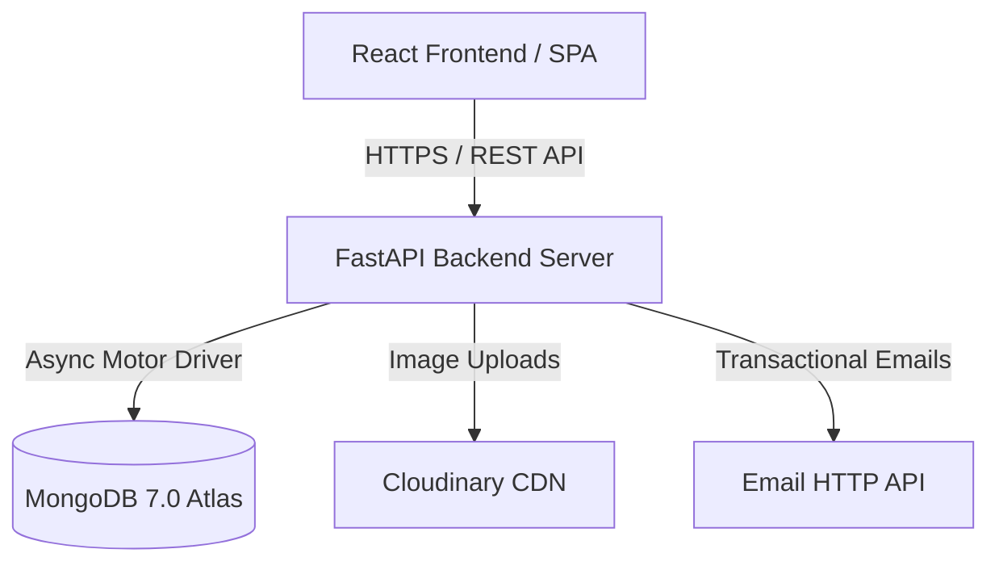

# DriveHub Goa — Project Executive Summary & Operations Manual

This document provides a complete guide for managing, operating, testing, deploying, and extending **Drivehub Goa** — an enterprise car rental management platform and booking engine for self-drive car rentals in Goa, India.

---

## 1. System Credentials & Portal Access

| Role | Access URL | Default Email | Default Password |
| :--- | :--- | :--- | :--- |
| **Super Admin** | `/admin/login` | `admin@drivehubgoa.com` | `Admin@123` |
| **Demo Customer** | `/login` | `demo@drivehub.goa` | `Demo@1234` |

> **Environment Sync**: To update admin login credentials for production, modify `ADMIN_EMAIL` and `ADMIN_PASSWORD` in `backend/.env`. On backend startup, credentials in MongoDB are automatically synchronized with environment settings.

---

## 2. Core Platform Capabilities & Modules

### 2.1. Customer Booking Engine
- **Vehicle Catalog**: Categorized by `Thar 4x4`, `SUV`, `Sedan`, `Hatchback`, `Convertible`.
- **Dynamic Fare Calculator**: 
  $$\text{Total Payable} = (\text{Daily Rate} \times \text{Days}) + \text{Addons} + \text{Airport Surcharge} - \text{Coupon Discount} + \text{Tax}$$
- **Location Hubs**: Complimentary pickup hubs (`Candolim (Main Hub)`, `Calangute`, `Baga`) and 24/7 Airport Delivery (`Dabolim Airport GOI`, `Mopa Airport GOX`).
- **Payment Workflow**: Integrated Mock Razorpay payment modal with automatic confirmation emails.
- **Invoice Generator**: Instant PDF (`reportlab`) and HTML invoice rendering with customer download links.
- **Booking Lookup**: Customer booking status lookup by email, phone, or reference code (`DHG-XXXXXX`).

### 2.2. Admin Management & CRM
- **Dashboard**: Real-time revenue analytics, active fleet utilization rates, 6-month historical trend line, recent bookings feed.
- **Calendar View**: Day-by-day interactive calendar displaying car pickups, returns, and ongoing rentals.
- **Fleet Manager**: Add/edit/delete vehicles, modify daily rates & security deposits, toggle maintenance overrides, and upload car photos directly to Cloudinary CDN.
- **Offline Walk-in Bookings**: Manual booking counter entry for walk-in customers with cash/UPI/card payment options.
- **Promo Coupons**: Manage percentage and fixed discount coupons with minimum subtotal requirements and auto-expiration dates.
- **CRM Lead Tracker**: Inbound lead management tracking customer origin cities, car models requested, acquisition channels (`WhatsApp`, `Instagram`, `Walk-in`, `Phone Call`, `Website`), and pipeline statuses (`New`, `Contacted`, `Follow-up`, `Converted`, `Lost`).
- **Excel Exports**: Single-click Excel workbook exports for bookings and CRM enquiries.

---

## 3. SEO, GEO & AI Discoverability Architecture

The application is optimized for traditional search engines and AI-powered search engines (ChatGPT, Perplexity, Claude, Gemini):

- **Dynamic SEO Component (`frontend/src/components/seo/SEO.jsx`)**: Page-specific titles, meta descriptions, canonical URLs, OpenGraph, and Twitter Cards.
- **Schema.org JSON-LD**: Embedded `CarRental` and `LocalBusiness` structured data tags with Candolim, Goa geo-coordinates, opening hours, and price ranges.
- **Static Discovery Files**:
  - `frontend/public/robots.txt`: Search crawler and AI bot permissions.
  - `frontend/public/sitemap.xml`: XML Sitemap with canonical URLs and change frequencies.
  - `frontend/public/llms.txt`: Generative Engine Optimization (GEO) file formatted specifically for AI search engine discoverability.

---

## 4. Architecture & Technology Stack



- **Backend**: FastAPI, Motor (Async MongoDB Driver), PyJWT, Passlib (Bcrypt), ReportLab (PDF), Openpyxl (Excel).
  - Modular Structure: `core/`, `models/`, `middleware/`, `services/`, `routes/`.
- **Frontend**: React (CRA/Craco wrapper), Tailwind CSS v3, Radix UI primitives, Lucide Icons, Framer Motion, Axios, Sonner toasts, `react-helmet-async`.

---

## 5. Key Developer Commands

### Local Development Setup (Windows)
Run `start_servers.bat` in the project root, or execute manually:
```bash
# Terminal 1: Backend API (Port 8000)
cd backend && python -m uvicorn server:app --host 127.0.0.1 --port 8000 --reload

# Terminal 2: React Frontend (Port 3000)
cd frontend && npm start
```

### Automated Unit & Integration Testing
```bash
python -m pytest backend/tests
```
*(100% PASS rate across all 48 test cases).*

### Production Build Compilation
```bash
cd frontend && npm run build
```

---

## 6. Deployment Architecture Options

### Option A — Free Cloud Hosting Stack
- **Frontend**: Host on [Vercel](https://vercel.com) (Root directory: `frontend`).
- **Backend**: Host on [Render](https://render.com) (Root directory: `backend`, Start command: `uvicorn server:app --host 0.0.0.0 --port 8000`).
- **Database**: [MongoDB Atlas M0 Free Tier](https://cloud.mongodb.com).

### Option B — Single-Command Docker Containerization (VPS / AWS / DigitalOcean)
```bash
docker-compose up -d --build
```
*Deploys MongoDB 7.0 container, FastAPI Backend container, and Nginx Frontend container.*

---

## 7. Critical Operational Guidelines

1. **Storage Optimization**: Car photos and document attachments are stored on Cloudinary CDN. MongoDB only stores text URLs, ensuring 512 MB storage lasts 20+ years.
2. **MongoDB Atlas IP Whitelisting**: Ensure `0.0.0.0/0` (Allow Access from Anywhere) is whitelisted in MongoDB Atlas Network Access so Render backend dynamic IPs can connect.
3. **Render Warm-Up**: Configure a free 10-minute HTTP ping on [UptimeRobot.com](https://uptimerobot.com) targeting `https://your-backend.onrender.com/api/healthz` to prevent Render's 30-second cold start delay.
