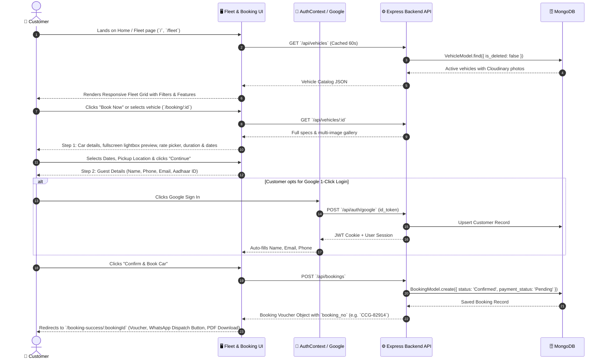
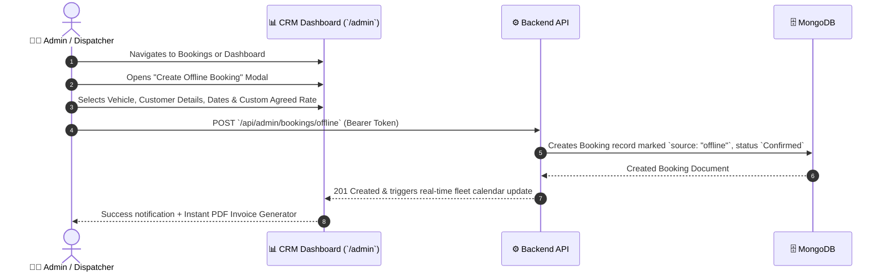
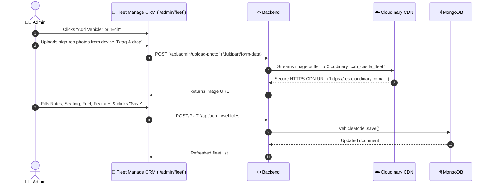
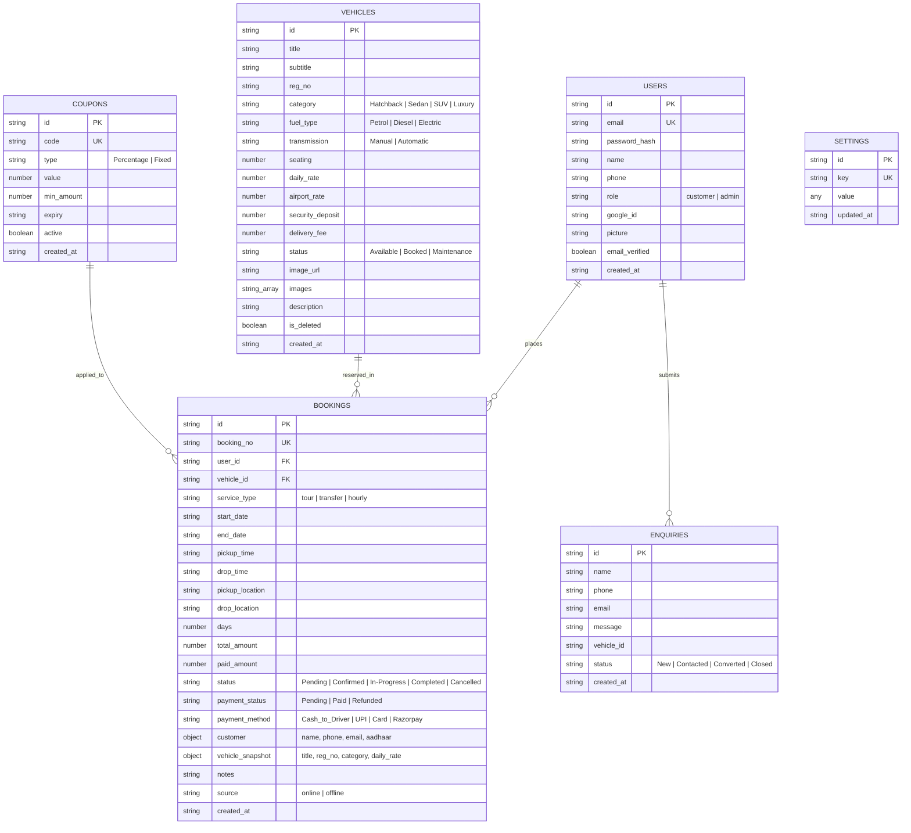

# Cab Castle Goa — System Architecture, User Flows & Data Flow Specification

**Version:** 2.0.0 (Enterprise Release)  
**Date:** September 2026  
**Stack:** React 18 (CRA / Tailwind / CSS Tokens), Node.js (Express / TypeScript), MongoDB (Mongoose), Cloudinary CDN, Google OAuth 2.0, Razorpay

---

## 1. System Architecture Overview

```mermaid
graph TD
    subgraph Client Layer
        Web[Web / Mobile Customer Browser]
        AdminCRM[Admin CRM Dashboard]
    end

    subgraph CDN & Auth
        Cloudinary[Cloudinary CDN - Vehicle Photos]
        GoogleOAuth[Google OAuth 2.0 / GSI]
    end

    subgraph Backend Layer (Node.js + Express + TS)
        API[Express REST API - Port 8000]
        Security[Security Middleware: Rate Limit, Helmet, JWT, CSRF]
        AuthCtrl[Auth Controller]
        BookingCtrl[Booking Controller]
        VehicleCtrl[Vehicle Controller]
        PaymentCtrl[Payment & Razorpay Controller]
        AdminCtrl[Admin & Analytics Controller]
    end

    subgraph Data Layer
        MongoDB[(MongoDB Database: cab_castle_goa)]
    end

    Web -->|HTTP / JSON| API
    AdminCRM -->|HTTP / Bearer JWT| API
    Web -->|Google Sign-In Token| GoogleOAuth
    AdminCRM -->|Image Upload Multi-part| API
    API -->|Base64 Data URI| Cloudinary
    API -->|Mongoose Queries .lean()| MongoDB
```

---

## 2. Comprehensive User Flows

### 2.1 Customer Booking Flow (Online Web Experience)



**Step-by-Step Breakdown:**
1. **Fleet Exploration:** Customer selects from Hatchback, Sedan, SUV, or Premium models. Real-time rates calculate per day or 8h/80km packages.
2. **Interactive Vehicle Gallery:** Customer can view photos, and click to open a high-res fullscreen zoomable Lightbox.
3. **Step 1 — Itinerary & Schedule:** Selection of Service Type (Hourly Sightseeing Package vs. Airport Transfer: Mopa / Dabolim / Margao / Thivim), Start Date, Start Time, End Date, Drop Time.
4. **Step 2 — Guest Verification:** Captures Name, WhatsApp Phone, Email, and Government ID (Aadhaar).
5. **Zero Advance Reservation:** Booking confirmed immediately without mandatory payment friction; pay-to-driver on trip completion.
6. **Voucher & WhatsApp Integration:** Automated WhatsApp dispatch message pre-filled with pickup coordinates and booking details.

---

### 2.2 Admin Offline Booking Flow



---

### 2.3 Authentication Flows

#### A. Customer Email/Password Registration & Login
- **Sign Up:** `POST /api/auth/register` with Name, Phone, Email, Password. Password is validated for minimum strength and hashed with `bcryptjs` (salt rounds: 10).
- **Sign In:** `POST /api/auth/login` checks credentials, issues HttpOnly secure JWT cookie `access_token` (24-hour expiration) and JSON response payload.
- **Session Persistence:** `GET /api/auth/me` validates token and returns active session state.

#### B. Google OAuth 2.0 Flow
- Customer clicks Google Sign-In button powered by Google Identity Services (GSI).
- Client acquires Google `id_token` JWT.
- Backend `POST /api/auth/google` verifies the `id_token` with Google OAuth tokeninfo service using `GOOGLE_CLIENT_ID`.
- System creates or updates user in MongoDB with `google_id`, avatar URL, verified email status, and returns session token.

#### C. Admin Authentication Guard
- Admin signs in via `/admin/login`.
- JWT contains `role: "admin"`.
- Backend middleware `getCurrentAdmin` enforces:
  - Valid cryptographic JWT signature with server `JWT_SECRET`.
  - Admin role check `decoded.role === 'admin'`.
  - Strict user identification against database admin records.

---

### 2.4 Vehicle Management Flow (Admin CRM)



---

## 3. Database Schema & Entity Relationships



---

## 4. End-to-End Data Flow Specification

### 4.1 Input Sources
1. **Customer Inputs:**
   - Vehicle selection and duration/package parameters.
   - Itinerary & Pickup/Drop locations (text & select menus).
   - Guest identity data: Name, WhatsApp Phone, Email, Aadhaar ID.
   - Google OAuth credential tokens (GSI response).
   - Promotional discount coupons.

2. **Admin Inputs:**
   - Vehicle catalog details, category tags, seating specs, base rates, airport transfer rates.
   - Multi-image file uploads (JPEG, PNG, WebP up to 10MB).
   - Offline booking dispatch entries.
   - Booking status transitions (`Confirmed` → `In-Progress` → `Completed`).
   - Coupon codes, expiry dates, and percentage/fixed discount rules.

### 4.2 Processing Layer
- **Input Validation & Sanitization:** Regex sanitization for email, phone, and dates. MongoDB queries sanitized against NoSQL injection via `escapeRegex`.
- **Image Processing Pipeline:**
  $$\text{Browser File} \xrightarrow{\text{Multer Memory Storage}} \text{Base64 URI} \xrightarrow{\text{Cloudinary API}} \text{Optimized CDN URL}$$
  URLs are formatted with `w_600,f_auto,q_auto` dynamic transformation parameters for ultra-low latency on 3G/4G networks.
- **Fare Computation Engine:**
  $$\text{Total Amount} = (\text{Days} \times \text{Daily Rate}) + \text{Airport / Night Surcharges} - \text{Coupon Discount}$$

### 4.3 Output Generation
- **REST JSON Responses:** Lean, sanitized JSON payloads.
- **Client Render Engine:** Smooth React tree with skeleton loading fallbacks, touch-optimized interactions, and fullscreen image lightbox.
- **Statutory Invoices:** Dynamic printable invoices with standard tax details, booking breakdown, and print styles.
- **Excel & PDF Exports:** Admin report streams for booking registries and driver dispatch sheets.
- **Security Audit Logs:** Structured console audit logs for critical authentication and data manipulation events.
